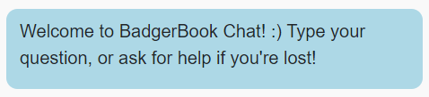
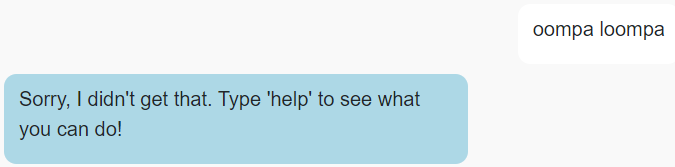

# CS571-SU24 HW10: BadgerBook (Chat!)

Welcome back to our final installment of BadgerBook! For this assignment, you will implement a slightly different version of BadgerBook as *a chat application*. The data provided will be of randomly generated, fictional people rather than of your fellow classmates.

## Setup

You will complete a [Wit.AI Agent](https://wit.ai/) and some JS handler code as a part of this assignment.

The starter code provided to you was generated using [vite](https://vitejs.dev/guide/). Furthermore, [bootstrap](https://www.npmjs.com/package/bootstrap) and [react-bootstrap](https://www.npmjs.com/package/react-bootstrap) have already been installed. In this directory, simply run...

```bash
npm install
npm run dev
```

Then, in a browser, open `localhost:5173`. You should *not* open index.html in a browser; React works differently than traditional web programming! When you save your changes, they appear in the browser automatically. I recommend using [Visual Studio Code](https://code.visualstudio.com/) to do your development work.

For this assignment, **you will only work on `ChatAgent.js`**. You should **not** change the React JSX components; these have been completed for you! Your focus is to solely write the code in `ChatAgent.js` that interfaces between your [Wit.AI Agent](https://wit.ai/) and the provided React frontend.

## API Notes

All data can be retrieved via GET request to [https://cs571api.cs.wisc.edu/rest/su24/hw10/person](https://cs571api.cs.wisc.edu/rest/su24/hw10/person). This data is randomly generated with the use of [FakerJS](https://fakerjs.dev/). Each response will be JSON containing an `id`, `name`, `country`, and `favorites`. `favorites` is an object consisting of a `prefers` of either "cat" or "dog", as well as the specific type of cat or dog. 

## Important
Within `handleInitialize`, the `person` variable has already been initialized for you with the data from [https://cs571api.cs.wisc.edu/rest/su24/hw10/person](https://cs571api.cs.wisc.edu/rest/su24/hw10/person). *You should **not** re-fetch this data unless explictly asked to do so in Step 7.* You may assume that `person` will be initialized *before* `handleReceive` is ever called.

## Special Requirements
 - *Only* modify your Wit.AI agent and `ChatAgent.js`. Do *not* modify any of the existing `.jsx` components.
 - *Each* intent within your Wit.AI agent should be trained on **5+ utterances** 
   - However, you do not need multiple responses for your intents; one response will do.
 - When `fetch`'ing data within `ChatAgent.js`, use the `async`/`await` syntax! Do not use `.then`.
 - When submitting your project, **please be sure to include a .ZIP of your Wit.AI agent!** Further instructions can be found underneath "Submission Details".

## BadgerBook

### 1. Provide Intent Mapping

Within the [Wit.AI web interface](https://wit.ai/), create an agent following intents...
 - `get_help`
 - `get_name`
 - `get_home_country`
 - `get_preference`
 - `next_person`

Then, within `ChatAgent.js`, map these intents to their corresponding function. Feel free to use and modify the code that we used for our in-class exercise!



### 2. Provide Fallback

Within `ChatAgent.js`, add logic to `handleReceive` such that if the given `prompt` cannot be understood by your Wit.AI agent, it simply tells the user to ask for help.



### 3. Provide Help

In your Wit.AI agent, train your agent to understand a `get_help` intent. Utterances along the lines of "help", "get help", or "what can I do" should trigger this intent.

Then, within `ChatAgent.js`, add logic to `handleReceive` such that if `prompt` matches the `get_help` intent, the agent provides the user with some basic tips such as "try getting my name, where I am from, or which type of pet I prefer".


### 4. Get Name

In your Wit.AI agent, train your agent to understand a `get_name` intent. Utterances along the lines of "what is your name", "who are you", or "what are you called" should trigger this intent.

Then, within `ChatAgent.js`, add logic to `handleReceive` such that if `prompt` matches the `get_name` intent, the agent provides the user with the `name` of `person`.


### 5. Get Country of Origin

In your Wit.AI agent, train your agent to understand a `get_home_country` intent. Utterances along the lines of "where are you from", "where's your home", or "what country are you from" should trigger this intent.

Then, within `ChatAgent.js`, add logic to `handleReceive` such that if `prompt` matches the `get_home_country` intent, the agent provides the user with the `country` of `person`.


### 6. Get Cats or Dogs

In your Wit.AI agent, train your agent to understand a `get_preference` intent. Utterances along the lines of "what's your favorite pet", "cats or dogs", or "do you prefer cats or dogs" should trigger this intent.

Then, within `ChatAgent.js`, add logic to `handleReceive` such that if `prompt` matches the `get_preference` intent, the agent provides the user with (a) what the `person` prefers (b) what specific type of that pet `person` prefers. This can be returned as a single response using string concatenation.


### 7. Next Person

In your Wit.AI agent, train your agent to understand a `next_person` intent. Utterances along the lines of "next person please", "next", or "I'd like to talk to someone new" should trigger this intent.

Then, within `ChatAgent.js`, add logic to `handleReceive` such that if `prompt` matches the `next_person` intent, the agent fetches a new `person` and informs the user as such. Future requests for name, country, or preferences should now use the traits of this `newPerson`.

**Hint:** It may be helpful to reference `handleInitialize`. You can simply re-assign what `person` holds with the data received from the API.


### Submission Details

**BE SURE TO INCLUDE A COPY OF YOUR WIT.AI AGENT!** You can download this by visiting your `Wit.AI Project > Management > Settings > Export Your Data > Download .zip with your data`. Please commit and push this ZIP file as a part of your Git repository.

In addition to your code, **you will also need to submit a video recording of your app**. Like the demo video, it should cover all the tasks below. Please thoroughly demonstrate all tasks to showcase the capabilities of your app.

**Please embed your recording as a Kaltura video as a part of the assignment submission.** You may find [Zoom](https://support.zoom.us/hc/en-us/articles/201362473-Enabling-and-starting-local-recordings) helpful for recording your screen.

#### Tasks 
1. Ask for help.
2. Type an out-of-scope message (e.g. "oompa loompa")
3. Ask for their name.
4. Ask for their name again.
5. Ask for their home country.
6. Ask whether they prefer cats or dogs.
7. Ask for the next person.
8. Ask for their name.
9. Ask for their home country.
10. Ask whether they prefer cats or dogs.