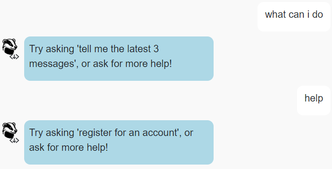
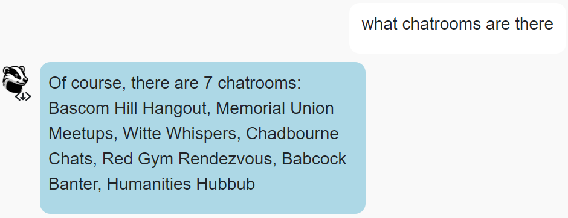
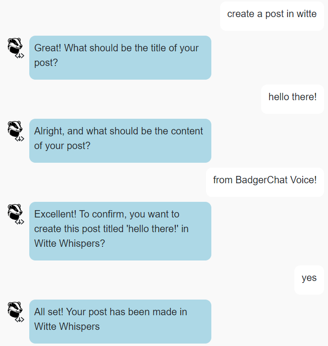

# CS571-SU24 HW12: BadgerChat (Voice!)

Welcome back to our final installment of BadgerChat! For this assignment, you will re-implement BadgerChat as *a chat application*. By completing this class, you will have developed a web, mobile, and chat interface for BadgerChat! 🥳🎉 

**Please Note:** The speech-to-text transcription and text-to-speech synthesis are just for fun! They have already been implemented and do *not* need to be a part of your demo.

## Setup

You will complete a [Wit.AI Agent](https://wit.ai/) and some JS handler code as a part of this assignment.

The starter code provided to you was generated using [vite](https://vitejs.dev/guide/). Furthermore, [bootstrap](https://www.npmjs.com/package/bootstrap) and [react-bootstrap](https://www.npmjs.com/package/react-bootstrap) have already been installed. In this directory, simply run...

```bash
npm install
npm run dev
```

Then, in a browser, open `localhost:5173`. You should *not* open index.html in a browser; React works differently than traditional web programming! When you save your changes, they appear in the browser automatically. I recommend using [Visual Studio Code](https://code.visualstudio.com/) to do your development work.

For this assignment, **you will only work on files within the `agent` folder**. You should **not** change the React JSX components; these have been completed for you! Your focus is to solely write the code in `agent` that interfaces between your [Wit.AI Agent](https://wit.ai/) and the provided React frontend.

## API Notes

All routes are relative to `https://cs571api.cs.wisc.edu/rest/su24/hw12/`

 - **This API has similar endpoints to HW6.**
 - **This API shares the same database as HW6 and HW9.**
 - **This API uses *cookies* for authentication.**
 - **This API does NOT paginate messages *nor* is a chatroom name required.**
   - Instead, a `chatroom` and max `num` of posts (up to 10) may optionally be specified.

See `API_DOCUMENTATION.md` for full details.

| Method | URL | Purpose | Return Codes |
| --- | --- | --- | --- |
| `GET`| `/chatrooms` | Get all chatrooms. | 200, 304 |
| `GET` | `/messages?chatroom=NAME&num=NUM`| Get latest `NUM` messages for specified chatroom. | 200, 400, 404 |
| `POST` | `/messages?chatroom=NAME` | Posts a message to the specified chatroom. | 200, 400, 404, 413 |
| `DELETE` | `/messages?id=ID` | Deletes the given message. | 200, 400, 401, 404 |
| `POST` | `/register` | Registers a user account. | 200, 400, 409, 413  |
| `POST` | `/login` | Logs a user in. | 200, 400, 401 |
| `POST` | `/logout` | Logs the current user out. | 200 |
| `GET` | `/whoami` | Gets details about the currently logged in user. | 200 |

**When making API calls with a request body, don't forget to include the header `"Content-Type": "application/json"`**

## Special Requirements
 - *Only* modify your Wit.AI agent and files within the `agent` folder. Do *not* modify any of the existing `.jsx` components.
 - While you may hardcode chatroom names as an entity of your Wit.AI agent, you may *not* hardcode them in your JavaScript code.
 - *Each* intent within your Wit.AI agent should be trained on **5+ utterances** 
   - Additionally, responses should be *varied*. Not every intent needs varied responses, but you should make use of `ofRandom` to vary your responses.
 - When `fetch`'ing data use the `async`/`await` syntax! Do not use `.then`.
 - When submitting your project, **please be sure to include a .ZIP of your Wit.AI agent!** Further instructions can be found underneath "Submission Details".

## BadgerMart

### 1. `get_help`

In your Wit.AI agent, train your agent to understand a `get_help` intent. Utterances along the lines of "help", "get help", or "what can I do" should trigger this intent.

Then, when this intent is triggered, a *varied response* should be given that gives hints, such as "Try asking 'give me a list of chatrooms', or ask for more help!" or "Try asking 'register for an account', or ask for more help!".



### 2. `get_chatrooms`

In your Wit.AI agent, train your agent to understand a `get_chatrooms` intent. Utterances along the lines of "chatrooms", "what chatrooms are there", or "what chatrooms can I use" should trigger this intent.

Then, when this intent is triggered, the agent should respond with the full list of chatrooms.

**Hint:** This data has already been fetched for you and stored as `chatrooms` within `ChatAgent.js`!



### 3. `get_messages`

In your Wit.AI agent, train your agent to understand a `get_messages` intent. Utterances along the lines of "messages", "give me the 4 latest posts", or "what are the 4 latest posts in Union South Socials" should trigger this intent.

Then, when this intent is triggered, the agent should respond with the latest X messages for Y chatroom as *consecutive responses*.

Note that both X and Y are optional entities. If the number is omitted, you may assume that it is 1. If the chatroom is omitted, you may assume that it is the latest overall posts across all chatrooms. You do **not** need to handle cases where the number is less than 1, greater than 10, negative, or a floating point number. You **can assume** a user will always either (a) not type a number at all or (b) type in a number between 1 and 10.

**Hint:** For this intent, you will likely need to create an entity within your Wit.AI agent. You may hardcode chatroom names within the Wit.AI agent, but you may not hardcode chatroom names within the `agent` folder.

**Hint:** You may find it helpful to provide synonym(s) for each of your chatrooms, e.g. "Witte Whispers" may be referred to as "Witte", however, this is up to you!


### 4. `login`

In your Wit.AI agent, train your agent to understand a `login` intent. Utterances along the lines of "login", "log in", or "log me in" should trigger this intent.

Then, when this intent is triggered, the agent should first check if the user is currently logged in. If the user is currently logged in, the agent should inform them that need to be logged out before logging in. Otherwise, the agent should *follow up* to collect the user's username and pin. Upon a successful login, the user should be informed that they were successfully logged in, otherwise that their username and pin combination was incorrect.

**Hint:** You may want to *delegate* this operation to `LoginSubAgent.js` like we do in the in-class exercise.


### 5. `register`

In your Wit.AI agent, train your agent to understand a `register` intent. Utterances along the lines of "register", "sign me up", or "I want an account" should trigger this intent.

Then, when this intent is triggered, the agent should first check if the user is currently logged in. If the user is currently logged in, the agent should inform them that need to be logged out before registering. Otherwise, the agent should  *follow up* to collect the user's username, pin, and confirm their pin. If the repeated pin does not match the original pin, or if either pin is not exactly 7 digits, the registration process should be cancelled. Furthermore, upon registration, if the username has already been taken, the user should be informed as such. Otherwise, the user should be informed that they were successfully registered and logged in.

**Hint:** You may want to *delegate* this operation to `RegisterSubAgent.js` like we do in the in-class exercise.


### 6. `whoami`

In your Wit.AI agent, train your agent to understand a `whoami` intent. Utterances along the lines of "am I logged in", "who am I", or "who am I logged in as" should trigger this intent.

Then, when this intent is triggered, if the user is not logged in, the user should be informed that they are not logged in. Otherwise, they should be told what their username is.


### 7. `logout`

In your Wit.AI agent, train your agent to understand a `logout` intent. Utterances along the lines of "logout", "log out", or "log me out" should trigger this intent.

Then, when this intent is triggered, the agent should first check if the user is currently logged in. If the user is *not* currently logged in, the agent should inform them that need to be logged in before logging out. Otherwise, the agent should log the user out and inform them as such.


### 8. `create_message`

In your Wit.AI agent, train your agent to understand a `create_message` intent. Utterances along the lines of "create a post", "make a post in union south socials", or "post a message to picnic point pathfinders" should trigger this intent.

Then, when this intent is triggered, the agent should first check if the user is currently logged in. If the user is *not* currently logged in, the agent should inform them that need to be logged in before creating a post. Additionally, a chatroom name **must** be specified. If the user fails to specify a chatroom name, inform them that they *must* specify a chatroom to post in. 

If the user is logged in and has specified a chatroom name, the agent should *follow up* to collect the title and content of the post. After collecting the title and content, the agent should do a final confirmation with the user. If a user confirms that they would like to create the post, a post should be made in the specified chatroom and the agent should inform the user as such. Otherwise, if the user fails to confirm the posting, the agent should *not* post the message and assure the user that the post has not been made.

**Hint:** You may want to *delegate* this operation to `CreatePostSubAgent.js` like we do in the in-class exercise.



### 9. Finishing Touches

Woohoo! You have a working product. For your finishing touches, go back and...

 1. **Mask pin use.** Anytime a user enters a pin (such as when registering and logging in), the pin field should be masked. Furthermore, the entered pin should not appear in the chat log and instead be replaced with "Sensitive information redacted!"
 2. **Make use of emotes.** Upon a successful login, register, or post creation a `bucki_success.png` emote should replace the Bucki avatar. Upon a failed login or register, a `bucki_error.png` emote should replace the Bucki avatar.

**Remember:** You are *not* allowed to change the underlying `.jsx` code. Instead, `TextApp.jsx` expects either a string, list of strings, object, or list of objects to be returned from `handleReceive`.

**Hint:** Rather than returning a message as a string, try returning a message as an object. Read through how `TextApp.jsx` uses `handleReceive` -- part of this challenge is reading through messy React code! :)


### Submission Details

**BE SURE TO INCLUDE A COPY OF YOUR WIT.AI AGENT!** You can download this by visiting your `Wit.AI Project > Management > Settings > Export Your Data > Download .zip with your data`. Please commit and push this ZIP file as a part of your Git repository.

In addition to your code, **you will also need to submit a video recording of your app**. Like the demo video, it should cover all the tasks below. Please thoroughly demonstrate all tasks to showcase the capabilities of your app.

**Please embed your recording as a Kaltura video as a part of the assignment submission.** You may find [Zoom](https://support.zoom.us/hc/en-us/articles/201362473-Enabling-and-starting-local-recordings) helpful for recording your screen.

#### Tasks 
 - Show different outputs from getting help
 - Show the different chatrooms that are available
 - Get the messages...
   - With the latest message
   - With the 2 latest messages
   - With the 3 latest messages for a particular chatroom
 - Attempt to login...
   - With an invalid username/pin combo.
   - With a valid username/pin combo.
 - Attempt to login when already logged in.
 - Logout.
 - Attempt to logout when already logged out.
 - See if you are logged in.
 - Attempt to register...
   - For a user that already exists.
   - With a pin that is not 7 digits.
   - For a valid, new account.
 - See if you are logged in.
 - Create a post...
   - Without specifying a chatroom name
   - With a chatroom name but without confirming
   - With a chatroom name and confirming
 - Show the latest posts for that chatroom in which you just created a post.

**Congrats!** You have completed your *last* homework for CS571! 🥳 Be sure to commit, push, and upload your demo to the Canvas assignment!
