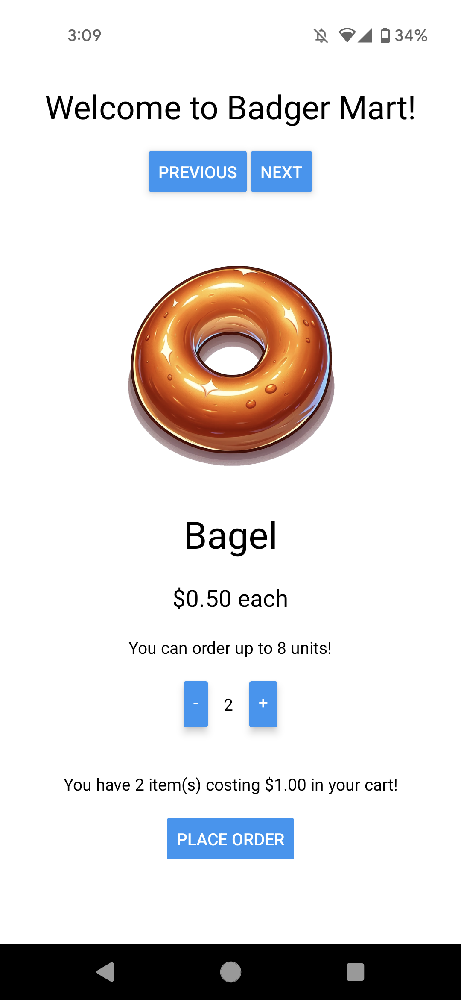
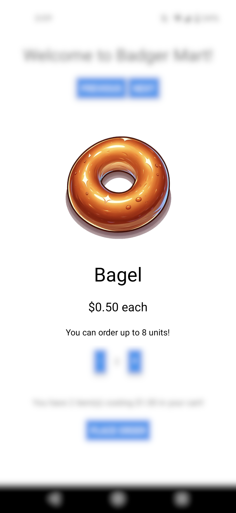
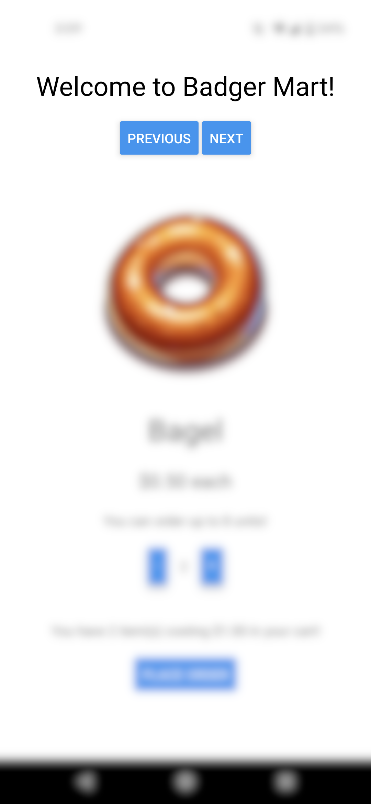
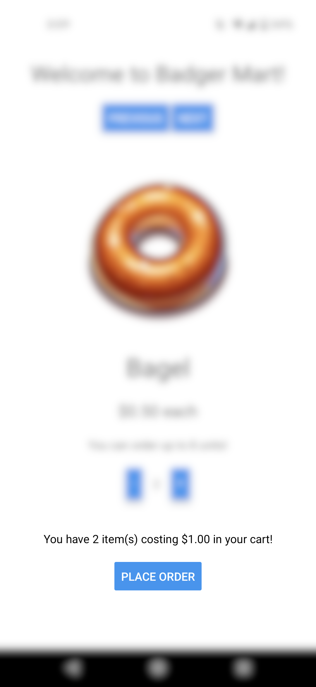
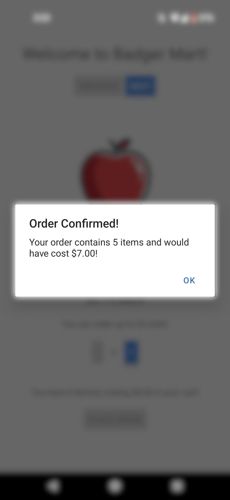

# CS571-SU24 HW7: Badger Mart (React Native!)

Welcome to Badger Mart, Mobile! For this assignment, you will implement a mobile app for Badger Mart.



## Badger Mart

The starter code provided to you was generated using [expo](https://expo.dev/), therefore the "boilerplate" code has already been generated. **You should *not* re-run the expo init command**. In this directory, simply run...

```bash
npm install
npm start
```

To test your app, you have a few options. If you have a smart device, I would recommend using the expo app for [iOS](https://apps.apple.com/us/app/expo-go/id982107779) or [Android](https://play.google.com/store/apps/details?id=host.exp.exponent&hl=en_US&gl=US). You can scan the QR code using your phone, or you can launch commands via the terminal. Otherwise, you can use an emulator (such as [AVD](https://developer.android.com/studio/run/emulator)). Do not use the web browser to test your code; you must test on Android or iOS!

Note that we are writing code in JavaScript for React Native; if you begin writing code in Objective-C, Swift, Java, or Kotlin you are likely doing something *very* wrong!

If you wish to avoid hardcoding your Badger ID, you may set an environment variable `EXPO_PUBLIC_CS571_BADGER_ID` with your `bid_...`. This may require a restart! Then, to get your Badger ID, you may...

```js
import CS571 from '@cs571/mobile-client'
// ...
CS571.getBadgerId(); // returns BID
```

## Important

 - You may assume that each item contains a unique`name` as well as a `price`, `img`, and `upperLimit`.
   - You should use `toFixed(2)` to format the price/total of any monetary amounts. 
   - You do not need to do anything with the `description`.
 - You may **NOT** hardcode the data of any items, such as their name. e.g. hardcoding "apple", "bagel", "coconut", "donut", or "eggs" is prohibited! Being a busy grocery store in Madison, the items we sell may vary from day-to-day, and we should *not* assume we will always be selling these same items.
 - It is okay if your buttons look different! This is expected behavior for iOS vs Android.


## Tasks

### 1. Display Items

Fetch the items from `https://cs571api.cs.wisc.edu/rest/su24/hw7/items` and display them to the screen, including their name, image, price, and how many can be ordered. You may assume that the name of each item is unique.

Do **NOT** use a `ScrollView`. We will paginate the items by creating "previous" and "next" buttons in Step 2. We will learn about and use a `ScrollView` in HW8.



### 2. Navigate Between Items

Instead of showing all items on the same screen, add "Previous" and "Next" buttons to allow the user to navigate between items. The "previous" button should be disabled when viewing the first item, and the "next" button should be disabled when viewing the last item.

I'd recommend creating a state variable which indicates which item the user is currently on within the list of items.



### 3. Add and Remove from Basket

Allow the user to add and remove items from their basket via "+" and "-" buttons. The "-" button should be disabled when the user has 0 of that item in their basket, and the "+" button should be disabled when the user has reached the `upperLimit` of that item.

I'd recommend creating a state variable in `BadgerMart.jsx` that tracks the number of each item ordered and passing this down through props or a context to `BadgerSaleItem.jsx`


### 4. Show Order Details

The (a) total cost (displayed to the nearest hundreth) and (b) number of items in the users' basket should be shown at the bottom of the screen.



### 5. Submit Order

The user should be able to "submit" their order by pressing a "place order" button. **This button should be disabled if there are no items in their basket.**

Upon submitting an order, a message should be displayed that says "Order Confirmed! Your order contains NUM_ITEMS items and costs $PRICE!" Be sure to display both the number of items sold and the total price. After, clear their basket and return to the first item.

**Note:** We aren't really "submitting" anything to the API, this should simply trigger an `Alert`.



### Submission Details
In addition to your code, **you will also need to submit a video recording of your app**. Like the demo video, it should cover all the tasks below. Please thoroughly demonstrate all tasks to showcase the capabilities of your app.

**Please embed your recording as a Kaltura video.**

#### Tasks 
 - Navigate between **all** sale items.
 - Add some items to your basket to enable the "place order" button.
 - Submit an order with some items.
 - Submit an order with the maximum number of atleast one sale item.

### Done! 🥳
Congrats! Add, commit, and push your files to GitHub Classroom. Then, paste your commit hash and embed your recording in the Canvas assignment.
